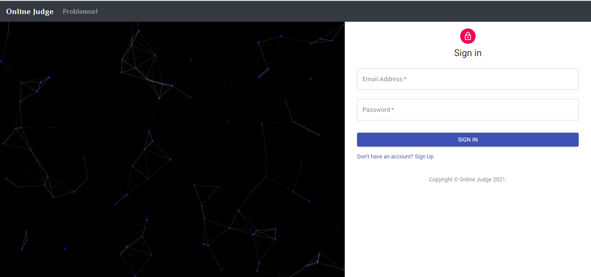
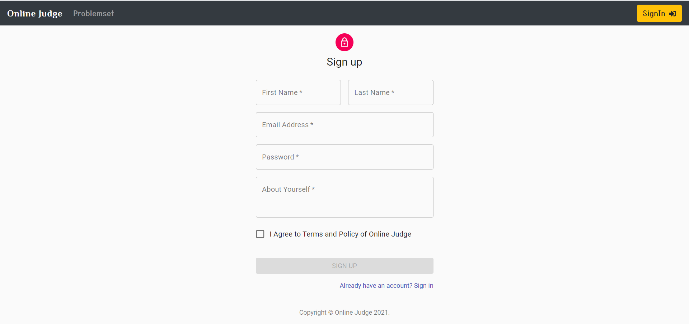
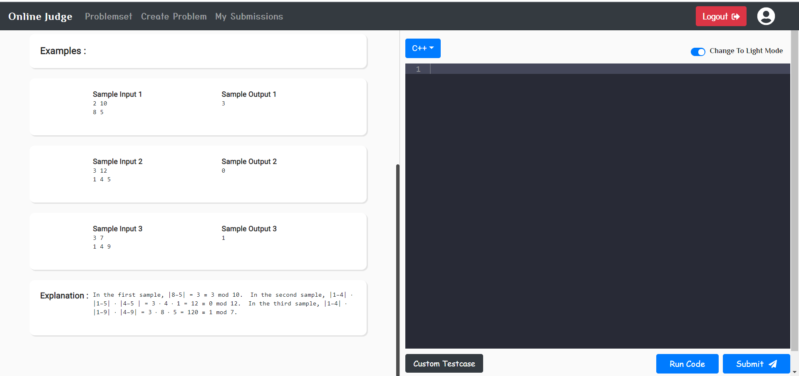
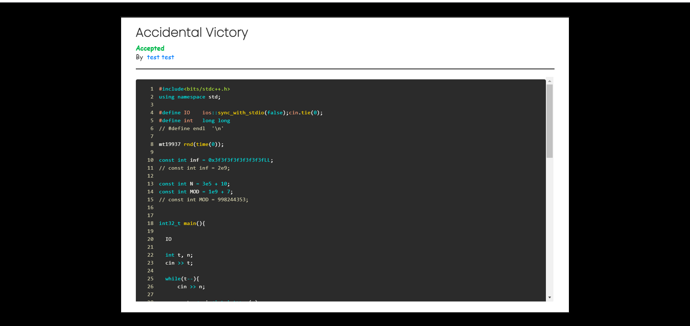
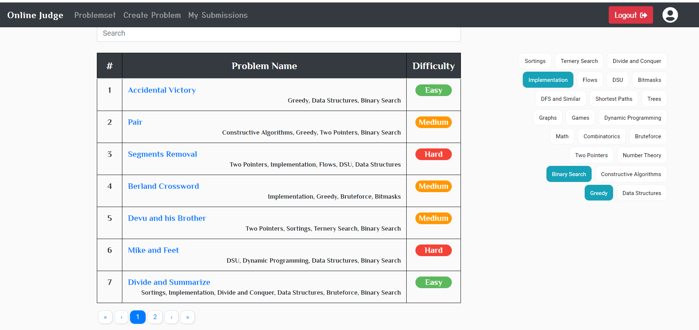

# Online-Judge
> #### An Online-judge system based on Node and React (MERN Stack).

## Features
- [x] Authentication and Authorization (includes Email verification)
- [x] Submit your code
- [x] Test your code
- [x] Results shows Time (Sec) and Memory (MB)
- [x] Verdicts
    * Time Limit Exceeded (TLE)  
    * Memory Limit Exceeded (MLE)  
    * Compilation Error (CE)  
    * Runtime Error (RTE)  
    * Wrong Answer (WA)  
    * Accepted (AC)  
- [x] See your submissions
- [x] Filter problems based on tags
- [x] Search problems by name
- [x] Create Coding Problems
- [x] Dashboard for Statistics
- [ ] Forgot password
- [ ] Contest
- [ ] Leaderboard
- [ ] Download Submissions
- [ ] Two-factor authentication
- [ ] OAuth login with Google, Facebook, and Github
- [ ] Problem upvotes and downvotes
- [ ] Specific blogs for posts and tutorials

## Supported Languages
* C
* C++ 11/14/17 (GCC)
* Java 8
* Python 3

## Prerequisite
+ Docker Desktop
+ Node.js

## Env Variables

Create a .env file in then root and add the following
### Make Sure to connect to gmail api at google developer console
```
PORT = 5000
MONGO_URI = your mongo url
JWT_PRIVATE_KEY = your JWT token
EMAIL_ID = your email Id 
PASSWORD = password for email Id
EMAIL_SECRET = your email secret
CLIENT_ID = your client Id
CLIENT_SECRET = your client secret
REDIRECT_URI = https://developers.google.com/oauthplayground
REFRESH_TOKEN = your refresh token
```

## Setup Locally
### Make sure to install docker in your machine.

> #### Start Docker Desktop

```bash
git clone https://github.com/jojozhuang/online-judge-mean.git
cd online-judge
```
### Client
```bash
cd client
npm install
npm start
```

### Server
```bash
cd server
mkdir submissions
npm install
cd docker
docker build -t <Image_Name> .
cd ..
npm start
```
### Make sure to start Docker Desktop before the command npm start. 

🎉 And that's it! You will now be able to visit <a href="http://localhost:3000/">http://localhost:3000/</a> URL and see your application up and running.

## Snapshots
### SignIn

### SignUp

### Problem Page

### Results

### User Submissions

### User Submission Modal

### Dashboard Charts

### Dashboard Charts

### Seachbox, Tags and Filter



## Thanks
+ I'd appreciate a star if you find this helpful.


## License

[MIT](http://opensource.org/licenses/MIT)

